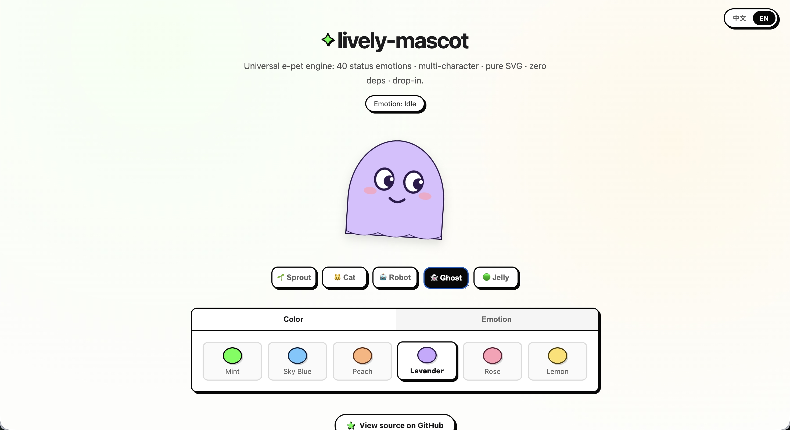
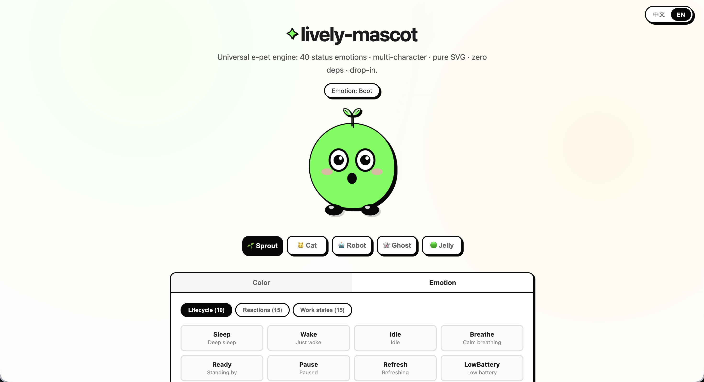

# ✦ lively-mascot

**English** · [简体中文](README.zh-CN.md)

> Tamagotchi engine: 40 Emotions · 5 Characters · Pure SVG · Zero Dependencies · Data-Driven · Drop-in.

An expression system for chatbots, desktop pets, web widgets, and AI assistants. Pick a character (Sprout / Cat / Robot / Ghost / Jelly) and switch expressions with `setEmotion(id)` — each emotion drives independent body, accessory, limb, and facial animations.

**[Live Demo](https://jingluoguo.github.io/lively-mascot/)**

## Features

<p align="center">
  
  
</p>

- **40 Status Emotions**: Covers lifecycle (sleep/idle), emotional reactions (happy/angry), work states (thinking/searching), and extended states (bored/nervous/eureka/waiting).
- **Multi-Character**: Ships with five bundled characters — **Sprout** (plant-styled), **Cat** (pet-styled), **Robot** (tech blocky head + antenna), **Ghost** (domed floating translucent with a 3-lobe wavy hem), and **Jelly** (bouncy blob). Swappable via `type` option with zero engine-level changes.
- **Full-Element Control**: Each emotion controls eyes, mouth, blush, body, accessories (leaf/ears/tail), and limbs — independent animation channels per character anatomy.
- **Configuration Driven**: Each emotion is a pure data combination (animations + filters + behavior params), supporting runtime registration.
- **Zero Dependencies, Zero Build**: Native JS, no framework, standard `<script>` tag order.
- **Plug-and-play**: Web Component `<lively-mascot>` and functional API `createMascot`.
- **Gaze Tracking**: Eyes follow the pointer smoothly; automatically pauses during emotions and resumes smoothly after.
- **Theming**: Multi-instance theme switching (`setTheme`), all styles via CSS variables.

## Quick Start

### Option A — npm (recommended for apps)

Install the package and import the SDK and stylesheet from your bundler:

```bash
npm install lively-mascot
```

```js
import { createMascot } from "lively-mascot";
import "lively-mascot/dist/lively-mascot.min.css";

const mascot = createMascot(document.getElementById("slot"), {
  type: "sprout", size: 180
});
mascot.setEmotion("10");
```

### Option B — One-line CDN (no download, no build)

The whole engine + all 5 characters ship as a single bundled file on jsDelivr. Just two tags:

```html
<link rel="stylesheet" href="https://cdn.jsdelivr.net/gh/jingluoguo/lively-mascot@master/dist/lively-mascot.min.css" />
<script src="https://cdn.jsdelivr.net/gh/jingluoguo/lively-mascot@master/dist/lively-mascot.min.js"></script>

<div id="slot"></div>
<script>
  // Sprout (plant mascot) — default
  var s = LivelyMascot.createMascot(document.getElementById('slot'), {
    type: 'sprout', size: 180
  });

  // Switch emotion (same API across all characters)
  s.setEmotion('10'); // Happy
  s.setEmotion('20'); // Thinking
  s.clearEmotion();   // Back to idle
</script>
```

> Tip: pin a version with `@latest` instead of `@master` for reproducible builds.

### Option C — Local / modular (split files)

If you prefer to serve the source files yourself (e.g. bundle via your own toolchain):

```html
<!-- Core: engine styles + emotions data + SDK -->
<link rel="stylesheet" href="src/lively-mascot.css" />
<script src="src/core/emotions.js"></script>
<script src="src/core/rig.js"></script>
<script src="src/lively-mascot.js"></script>

<!-- Character styles + renderers (order doesn't matter among characters) -->
<link rel="stylesheet" href="src/characters/sprout.css" />
<link rel="stylesheet" href="src/characters/cat.css" />
<link rel="stylesheet" href="src/characters/robot.css" />
<link rel="stylesheet" href="src/characters/ghost.css" />
<link rel="stylesheet" href="src/characters/jelly.css" />
<script src="src/characters/sprout.js"></script>
<script src="src/characters/cat.js"></script>
<script src="src/characters/robot.js"></script>
<script src="src/characters/ghost.js"></script>
<script src="src/characters/jelly.js"></script>

<div id="slot"></div>
<script>
  // Sprout (plant mascot) — default
  var s = LivelyMascot.createMascot(document.getElementById('slot'), {
    type: 'sprout', size: 180
  });

  // Cat / Robot / Ghost / Jelly — same engine, different anatomy
  // var c = LivelyMascot.createMascot(c, {
  //   type: 'cat', size: 180
  // });

  // Switch emotion (same API across all characters)
  s.setEmotion('10'); // Happy
  s.setEmotion('20'); // Thinking
  s.clearEmotion();   // Back to idle
</script>
```

### Option D — Using in React / Vue

For npm-based React/Vue apps, import the API and stylesheet directly:

```js
import { createMascot } from "lively-mascot";
import "lively-mascot/dist/lively-mascot.min.css";
```

Alternatively, load the engine script once via CDN; it registers the global `LivelyMascot`:

```html
<!-- Add to your entry HTML once, app-wide -->
<link rel="stylesheet" href="https://cdn.jsdelivr.net/gh/jingluoguo/lively-mascot@master/dist/lively-mascot.min.css" />
<script src="https://cdn.jsdelivr.net/gh/jingluoguo/lively-mascot@master/dist/lively-mascot.min.js"></script>
```

**React (imperative + ref, so you can drive emotions from code)**

```jsx
import { useEffect, useRef } from "react";

export function Mascot({ type = "sprout", size = 180 }) {
  const host = useRef(null);
  const inst = useRef(null);

  // Re-create only when type / size change
  useEffect(() => {
    inst.current = LivelyMascot.createMascot(host.current, { type, size });
    return () => inst.current && inst.current.destroy();
  }, [type, size]);

  return (
    <div>
      <div ref={host} />
      <button onClick={() => inst.current.setEmotion("10")}>Happy</button>
      <button onClick={() => inst.current.setEmotion("20")}>Thinking</button>
      <button onClick={() => inst.current.clearEmotion()}>Idle</button>
    </div>
  );
}
```

**Vue 3 (`<script setup>`)**

```vue
<script setup>
import { ref, onMounted, onBeforeUnmount, watch } from "vue";

const props = defineProps({ type: { default: "sprout" }, size: { default: 180 } });
const el = ref(null);
let inst = null;

const mount = () =>
  (inst = LivelyMascot.createMascot(el.value, { type: props.type, size: props.size }));
onMounted(mount);
onBeforeUnmount(() => inst && inst.destroy());
watch(() => [props.type, props.size], () => { inst && inst.destroy(); mount(); });

const set = (id) => inst && inst.setEmotion(id);
const reset = () => inst && inst.clearEmotion();
</script>

<template>
  <div>
    <div ref="el" />
    <button @click="set('10')">Happy</button>
    <button @click="set('20')">Thinking</button>
    <button @click="reset()">Idle</button>
  </div>
</template>
```

> Tip: if you only need a **static** mascot (no code-driven emotion switching), the easiest path is calling `LivelyMascot.defineMascotElement()` once, then just dropping the tag into your template (attribute changes auto-rebuild it).

**Plain HTML (no framework needed)**

```html
<script>
  LivelyMascot.defineMascotElement(); // register <lively-mascot>, once app-wide
</script>

<!-- Declarative usage; the browser renders and loops the idle animation -->
<lively-mascot type="cat" color="#ffd66b" size="180" view-mode="3d"></lively-mascot>
<lively-mascot type="ghost" color="#9be7ff" size="160"></lively-mascot>
```

**React**

```jsx
import { useEffect } from "react";

export function Mascot() {
  useEffect(() => { LivelyMascot.defineMascotElement(); }, []);
  return <lively-mascot type="cat" color="#ffd66b" size="180" />;
}
```

**Vue 3**

```vue
<script setup>
import { onMounted } from "vue";
onMounted(() => LivelyMascot.defineMascotElement());
</script>

<template>
  <lively-mascot type="cat" color="#ffd66b" size="180" />
</template>
```

> Note: the declarative tag reacts to the `type` / `color` / `size` / `view-mode` / `show-outline` attributes and rebuilds when any of them change. It does not expose an instance, so you cannot call `setEmotion` directly. When you need code-driven emotion or view-mode switching, use the `createMascot` approach above.

## Building from Source

### npm / bundler

The package exposes CommonJS and ESM entry points, plus TypeScript declarations:

```js
import { createMascot, emotions } from "lively-mascot";
// CommonJS: const { createMascot } = require("lively-mascot");
```

The browser-only CDN bundle remains available at `dist/lively-mascot.min.js`.

The single-file bundles in `dist/` are generated by `scripts/build-dist.mjs` (esbuild), which concatenates the engine + all 5 characters and minifies them.

```bash
npm install        # install esbuild (the only build dependency)
npm run build      # equivalent to: node scripts/build-dist.mjs
```

This regenerates `dist/lively-mascot.min.js` and `dist/lively-mascot.min.css`. Run it whenever you edit anything under `src/`. The `dist/` folder is included in the npm package (`files` in `package.json`) and served via jsDelivr's `@master` / `@vX.Y.Z` references.

## API

### `createMascot(target, options)`

| Option         | Type      | Default    | Description               |
| -------------- | --------- | ---------- | ------------------------- |
| `type`         | `string`  | `"sprout"` | Character ID              |
| `color`        | `string`  | —          | Body color                |
| `outline`      | `string`  | —          | Outline / eye color       |
| `accent`       | `string`  | —          | Accent color (blush etc.) |
| `size`         | `number`  | `106`      | Container size in px      |
| `followCursor` | `boolean` | `true`     | Enable gaze tracking      |
| `viewMode`     | `string`  | `"3d"`    | Visual mode: `"2d"` or `"3d"` (lightweight depth) |
| `outlineVisible` | `boolean` | `true` | Show the outer silhouette outline |

**Returns**: `{ el, type, viewMode, setViewMode(mode), outlineVisible, setOutlineVisible(visible), setTheme, setEmotion(id), clearEmotion(), destroy() }`

3D is a lightweight CSS depth treatment with no WebGL dependency. Switch a live instance with `setViewMode("2d")` / `setViewMode("3d")`; declarative `<lively-mascot>` also accepts `view-mode="2d"` (with `mode` as an alias).

Set `outlineVisible: false` or call `setOutlineVisible(false)` to hide the outer silhouette ink while keeping facial details visible. The declarative element accepts `show-outline="false"` as well.

Character renderers can register interchangeable face decorations through the rig API: `rig.registerFaceAccessory(name, element)` and `rig.setFaceAccessory(name)`. This is useful for optional whiskers, masks, glasses, or other model-specific details.

### Emotion Behaviors

Each emotion can configure:

| Field        | Description                                            |
| ------------ | ------------------------------------------------------ |
| `bodyAnim`   | Body CSS animation                                     |
| `bodyFilter` | Body filter (dim, grayscale, etc.)                     |
| `leafAnim`   | Leaf CSS animation                                     |
| `footAnim`   | Feet CSS animation                                     |
| `blink`      | `false` to disable blinking, `"fast"` for rapid blinks |
| `gaze`       | `false` to pause gaze tracking                         |

### Emotion ID Mapping

| Group           | ID    | Emotions                                                                                                                     |
| :-------------- | :---- | :--------------------------------------------------------------------------------------------------------------------------- |
| **Lifecycle**   | 00-09 | Sleep · Wake · Idle · Breathe · Ready · Pause · Refresh · LowBattery · Offline · Boot                                        |
| **Reactions**   | 10-19 | Happy · Excited · Sad · Angry · Surprised · Shy · Love · Confused · Cool · Smug                                              |
| **Work States** | 20-31 | Thinking · Listening · Talking · Searching · Reading · Writing · Coding · Designing · Loading · Processing · Success · Error |
| **Extended**    | 32-39 | Grateful · Retrying · Cancelled · Crying · Bored · Nervous · Eureka · Waiting                                                |

## Extension Guide

### Registering a New Character

A character is just a `render(api, gazeEl)` function that draws its DOM and registers moving parts with the rig **api**. The gaze wrapper `gazeEl` is where every part is appended, so the whole character leans/turns together with the body posture.

```js
function renderMyChar(rig, gazeEl) {
  // 1. Body — must be appended to gazeEl and registered
  var body = document.createElement('div');
  body.className = 'lively-body lively-body--myChar';
  rig.registerBody(body);

  // 2. Face — reuse the shared, emotion-aware face builder
  //    (eyes / pupils are wired internally; do NOT register them by hand)
  var face = LivelyMascot.buildFaceSvg(rig);
  body.appendChild(face.wrap);

  // 3. Optional top decoration (leaf/ears/antenna) → registerLeaf
  //    Pass { useLeafAnim: false } to drive its motion via your own CSS.
  //    rig.registerLeaf(decoEl, { useLeafAnim: false });

  // 4. Optional bottom channel (feet / tail / hem) → registerFeet
  //    rig.registerFeet(feetEl);

  gazeEl.appendChild(body);
}
LivelyMascot.registerCharacter('myChar', renderMyChar, 'My Char');
```

### Registering New Emotions

```js
LivelyMascot.emotions['50'] = {
  id: '50', name: 'Custom', group: 'custom', desc: 'Custom',
  bodyAnim: 'my-custom-anim 1s ease-in-out',
  leafAnim: 'my-leaf-anim 1s ease-in-out',
  footAnim: 'my-foot-anim 1s ease-in-out',
};
```

## Project Structure

```
lively-mascot/
├── index.html                  # Demo: Hero + Color/Emotion + Character switcher
├── src/
│   ├── core/
│   │   ├── emotions.js         # 40 Emotion definitions (pure data)
│   │   └── rig.js              # Animation engine (gaze / blink / hop / emotion state)
│   ├── characters/
│   │   ├── sprout.js / .css    # Sprout  (plant: body + leaf + feet)
│   │   ├── cat.js    / .css    # Cat     (pet: body + ears + tail + paws)
│   │   ├── robot.js  / .css    # Robot   (blocky head + antenna + mech feet)
│   │   ├── ghost.js  / .css    # Ghost   (domed translucent body + in-body 3-lobe hem)
│   │   └── jelly.js  / .css    # Jelly   (translucent bouncy blob, no leaf/feet)
│   ├── lively-mascot.js        # Core SDK (character registry + createMascot)
│   └── lively-mascot.css       # Engine-level styles (structure + emotion selectors)
├── package.json
└── README.md
```

## License

MIT
