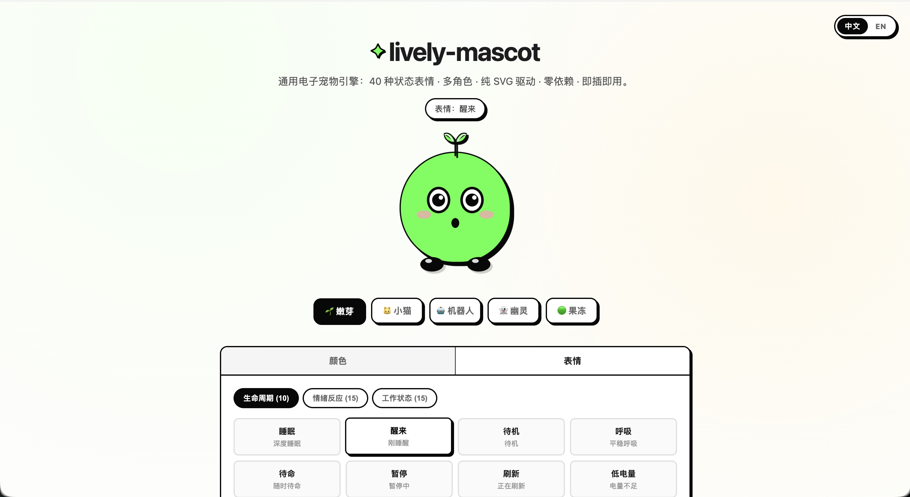
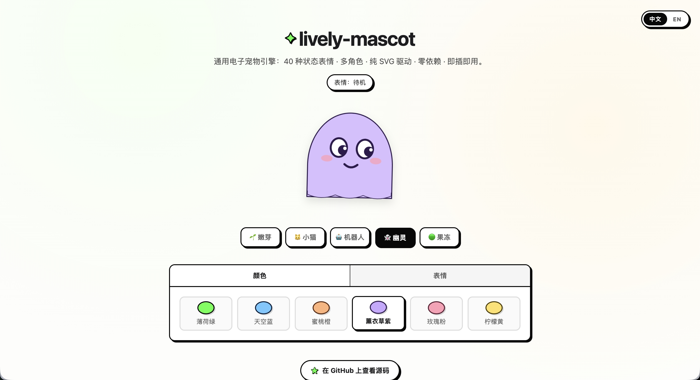

# lively-mascot

[English](README.md) · **简体中文**

> 零依赖 SVG 吉祥物引擎，内置 40 种表情状态和 5 个角色。

适用于聊天机器人、桌面宠物、网页组件和 AI 助手。选择角色后，通过
`setEmotion(id)` 驱动对应表情。

**[在线预览](https://jingluoguo.github.io/lively-mascot/)**

<p align="center">
  
  
</p>

## 特性

- 覆盖生命周期、情绪反应、工作状态和扩展状态的 40 种表情。
- 内置嫩芽、小猫、机器人、幽灵和果冻 5 个角色。
- 支持视线跟随、2D/3D 展示、五官样式、外轮廓控制和 CSS 变量主题。
- 提供无框架 API，以及可选的 `<lively-mascot>` 自定义元素。
- 支持导入 SVG/HTML 自定义模型和注册原生角色渲染器。

## 快速开始

安装：

```bash
npm install lively-mascot
```

```js
import { createMascot } from "lively-mascot";
import "lively-mascot/dist/lively-mascot.min.css";

const mascot = createMascot(document.querySelector("#slot"), {
  type: "sprout",
  size: 180
});

mascot.setEmotion("10"); // 开心
```

也可以通过 jsDelivr 直接加载：

```html
<link rel="stylesheet" href="https://cdn.jsdelivr.net/gh/jingluoguo/lively-mascot@master/dist/lively-mascot.min.css" />
<script src="https://cdn.jsdelivr.net/gh/jingluoguo/lively-mascot@master/dist/lively-mascot.min.js"></script>

<div id="slot"></div>
<script>
  var mascot = LivelyMascot.createMascot(document.querySelector("#slot"), {
    type: "cat",
    size: 180
  });
  mascot.setEmotion("10");
</script>
```

生产环境请固定版本号，例如 `@v0.2.0`，不要使用 `@master`。

## 文档导航

| 需求 | 文档 |
| --- | --- |
| API 参数、实例方法和全部表情 ID | [API 参考](docs/guide.zh-CN.md#api-参考) |
| React、Vue、纯 HTML、自定义元素或源码模块化接入 | [接入指南](docs/guide.zh-CN.md#接入) |
| 导入 SVG/HTML 自定义模型 | [自定义模型](docs/guide.zh-CN.md#自定义模型) |
| 用 Codex 根据图片生成模型 | [图片模型 Skill](docs/guide.zh-CN.md#图片模型-skill) |
| 添加角色或表情 | [扩展引擎](docs/guide.zh-CN.md#扩展引擎) |
| 构建发布文件 | [从源码构建](docs/guide.zh-CN.md#从源码构建) |

## 常用 API

```js
mascot.setEmotion("20");               // 思考中
mascot.setViewMode("2d");
mascot.setFaceVariant("simple");
mascot.setTheme({ body: "#67d9ff" });
mascot.setOutlineVisible(false);
mascot.clearEmotion();
mascot.destroy();
```

内置角色：`sprout`、`cat`、`robot`、`ghost`、`jelly`。

## 项目结构

```text
src/             引擎、动画 rig 和内置角色渲染器
skills/          图片转吉祥物的 Codex Skill
dist/            生成的浏览器和 npm 包文件
index.html       交互演示页
docs/            接入、API、自定义模型和扩展指南
```

## 许可证

MIT
